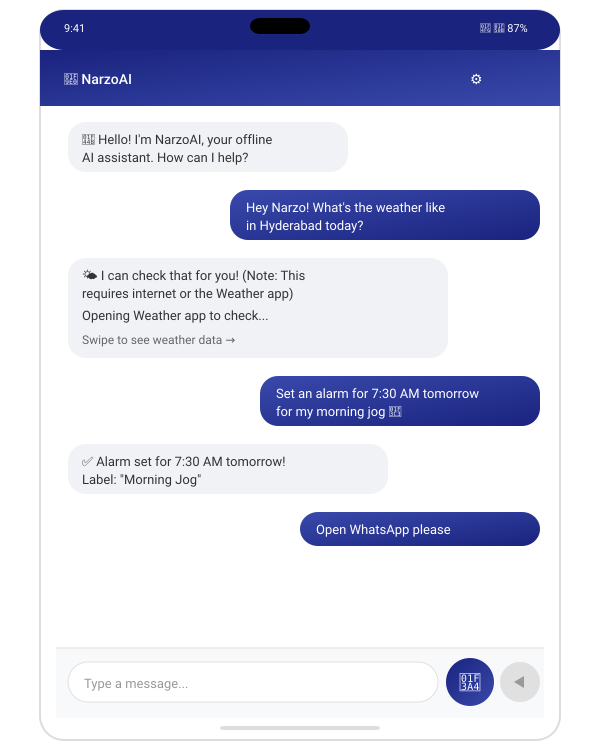
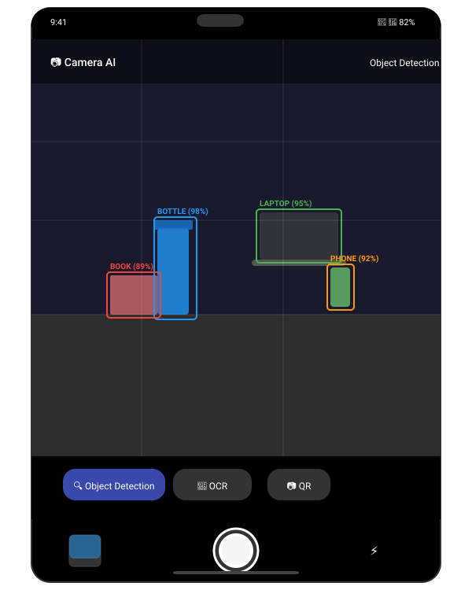
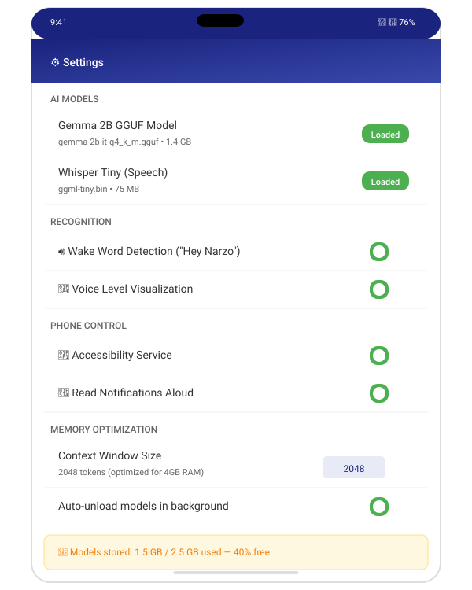

# 🧠 NarzoAI Assistant

**Your Offline AI Assistant for Android — Voice, Vision, and Phone Control, All On-Device.**

NarzoAI Assistant is a fully offline Android AI assistant that combines:
- **Gemma 2B** (Google's lightweight LLM) for intelligent chat
- **Whisper Tiny** (OpenAI) for speech recognition
- **Google ML Kit** for camera-based object detection and OCR
- **Android Accessibility Service** for phone control and automation

All AI processing happens **entirely on-device** — no internet connection required after downloading the models.

---

## ✨ Features

### 🎤 Offline Voice Recognition
- Uses OpenAI's Whisper Tiny model (via whisper.cpp)
- Hold-to-speak microphone button
- Wake word detection ("Hey Narzo")
- Real-time voice level visualization

### 💬 Offline AI Chat
- Google's Gemma 2B GGUF quantized model (via llama.cpp)
- Conversation history with context window management
- Streaming response generation
- Optimized for 4GB RAM devices

### 📷 Camera AI
- Real-time object detection (Google ML Kit)
- Text recognition / OCR (Google ML Kit)
- Barcode and QR code scanning
- Bounding box overlay on detected objects

### 📱 Phone Control
- Open any app by voice command
- Set alarms and timers
- Send WhatsApp messages
- Control WiFi, Bluetooth, brightness, and volume
- Read notifications aloud
- Gesture control (back, home, recent apps)

### 🔊 Text to Speech
- Android's built-in TTS engine (fully offline)
- Adjustable speech rate and pitch
- Queue management with interruption support

### ⚡ Optimized for 4GB RAM
- Lazy model loading — models are loaded only when needed
- Memory-mapped model files (mmap) for efficient loading
- Automatic model unloading when app is in background
- Reduced context window (2048 tokens) to limit memory usage
- Chat history trimming to prevent unbounded memory growth
- Low-resolution camera analysis (640x480)

---

## 📋 Requirements

- **Android Device**: Android 10 (API 29) or higher
- **RAM**: 4GB minimum (tested on 4GB devices)
- **Storage**: 2.5GB free space for model files
- **CPU**: ARM64 (arm64-v8a) or ARMv7 (armeabi-v7a)

---

## 🚀 Installation

### Method 1: Build from Source (Recommended)

#### Prerequisites
- Android Studio Hedgehog or later
- Android SDK 34
- JDK 17
- USB Debugging enabled on your phone

#### Steps

1. **Clone the repository**
   ```bash
   git clone https://github.com/Anilg1997/NarziAI-assistant-mobile-platform.git
   cd NarzoAI-Assistant
   ```

2. **Open in Android Studio**
   - File → Open → Select the project folder
   - Wait for Gradle sync to complete

3. **Enable Developer Options on your phone**
   - Settings → About Phone → Tap "Build Number" 7 times
   - Settings → Developer Options → Enable USB Debugging

4. **Connect your phone via USB**

5. **Build and install**
   ```bash
   # Using terminal
   ./gradlew installDebug
   
   # Or click the Run button in Android Studio
   ```

6. **Grant permissions** when prompted on first launch

### Method 2: Install APK Directly
- Download the latest APK from the Releases section
- Enable "Install from unknown sources" in Settings
- Open the APK file to install

---

## 📥 Download AI Models

After installing the app, you need to download the AI models:

### 1. Download Gemma 2B GGUF
- **URL**: https://huggingface.co/google/gemma-2b-GGUF
- **File**: `gemma-2b-it-q4_k_m.gguf` (recommended for 4GB RAM)
- **Size**: ~1.4GB

### 2. Download Whisper Tiny
- **URL**: https://huggingface.co/ggerganov/whisper.cpp
- **File**: `ggml-tiny.bin`
- **Size**: ~75MB

### 3. Place Models in Correct Location

**Option A — Internal Storage (Recommended)**:
Copy model files to your phone, then in the app:
```
Settings → Download Models → Select model file
```

**Option B — Assets directory (for developers)**:
```bash
# Place models in the assets directory before building
cp gemma-2b-it-q4_k_m.gguf app/src/main/assets/models/
cp ggml-tiny.bin app/src/main/assets/models/
```

**Option C — Copy via ADB**:
```bash
# Push model files to the app's files directory
adb push gemma-2b-it-q4_k_m.gguf /sdcard/NarzoAI/models/
adb push ggml-tiny.bin /sdcard/NarzoAI/models/
```

Then in the app, go to Settings → Import Models from Storage.

---

## 🎯 Usage

### Basic Commands

| Voice Command | Action |
|--------------|--------|
| "Hey Narzo" | Activate the assistant |
| "Open WhatsApp" | Launch WhatsApp |
| "Set alarm at 7:30 AM" | Set an alarm |
| "Send WhatsApp to +1234567890 Hello" | Open WhatsApp with message |
| "WiFi on / off" | Toggle WiFi |
| "Bluetooth on / off" | Toggle Bluetooth |
| "Volume up / down" | Adjust volume |
| "Brightness 50%" | Set screen brightness |
| "What's my battery level?" | Check battery |
| "Open camera" | Start camera AI |
| "Clear chat" | Clear conversation |
| "Read notifications" | Read latest notification |

### Camera AI Mode
- Tap the camera icon in the toolbar
- Toggle between **Object Detection** and **Text Recognition**
- Point camera at objects/text to analyze
- Results are displayed on screen

---

## 🏗️ Project Structure

```
NarziAI-assistant-mobile-platform/
├── app/
│   ├── src/main/
│   │   ├── java/com/narzoai/assistant/
│   │   │   ├── MainActivity.kt          # Main chat UI
│   │   │   ├── AIEngine.kt              # Gemma 2B integration
│   │   │   ├── VoiceEngine.kt           # Whisper integration
│   │   │   ├── PhoneController.kt       # Phone control features
│   │   │   ├── CameraAI.kt              # ML Kit integration
│   │   │   ├── CameraActivity.kt        # Camera UI
│   │   │   ├── TTSEngine.kt             # Text to speech
│   │   │   ├── ChatAdapter.kt           # Chat RecyclerView adapter
│   │   │   ├── SettingsActivity.kt      # Settings screen
│   │   │   ├── ModelService.kt          # Background model service
│   │   │   └── NarzoAccessibilityService.kt  # Accessibility service
│   │   ├── res/
│   │   │   ├── layout/                  # XML layouts
│   │   │   ├── drawable/                # Icons and shapes
│   │   │   ├── values/                  # Colors, strings, themes
│   │   │   ├── menu/                    # Menu definitions
│   │   │   └── xml/                     # Service configs
│   │   ├── assets/models/              # AI model files
│   │   └── AndroidManifest.xml
│   └── build.gradle
├── build.gradle
├── settings.gradle
├── gradle.properties
├── .gitignore
├── LICENSE
└── README.md
```

---

## 🛠️ Technical Stack

| Component | Technology |
|-----------|-----------|
| Language | Kotlin 1.9.22 |
| Min SDK | Android 10 (API 29) |
| Target SDK | Android 14 (API 34) |
| AI Model | Gemma 2B GGUF (via llama.cpp) |
| Voice | Whisper Tiny (via whisper.cpp) |
| Camera AI | Google ML Kit |
| UI | Material Design 3, ConstraintLayout |
| Architecture | MVVM with Kotlin Coroutines |
| Build | Gradle 8.2 with Kotlin DSL |

### Dependencies
- AndroidX Core KTX
- Material Design 3
- CameraX
- Google ML Kit (Object Detection, Text Recognition)
- Kotlin Coroutines
- Gson
- OkHttp

---

## 🔒 Permissions

The app requires the following permissions:

| Permission | Purpose |
|-----------|---------|
| `RECORD_AUDIO` | Voice recognition |
| `CAMERA` | ML Kit object detection and OCR |
| `ACCESSIBILITY_SERVICE` | Phone control (open apps, press buttons) |
| `BLUETOOTH_CONNECT` | Control Bluetooth |
| `ACCESS_WIFI_STATE` | Check WiFi status |
| `CHANGE_WIFI_STATE` | Toggle WiFi on/off |
| `POST_NOTIFICATIONS` | Read notifications aloud |
| `SYSTEM_ALERT_WINDOW` | Show status overlay |
| `FOREGROUND_SERVICE` | Keep model loaded in background |

---

## 💾 Memory Optimization (4GB RAM)

NarzoAI is specifically optimized for devices with 4GB RAM:

1. **Lazy Loading**: AI models are loaded on-demand, not at startup
2. **mmap**: Models are memory-mapped for efficient loading
3. **Auto Unloading**: Models are freed when app goes to background
4. **Context Window**: Limited to 2048 tokens to reduce memory usage
5. **Chat History**: Capped at 20 messages to prevent unbounded growth
6. **Camera Resolution**: Set to 640x480 for ML Kit analysis
7. **CPU Only**: GPU layers disabled to avoid GPU memory pressure
8. **Quantized Models**: Uses Q4_K_M quantization (4-bit) for smallest memory footprint

---

## 🧪 Building and Testing

```bash
# Debug build
./gradlew assembleDebug

# Release build
./gradlew assembleRelease

# Run tests
./gradlew test

# Install on connected device
./gradlew installDebug

# Run lint checks
./gradlew lint
```

---

## 🤝 Contributing

Contributions are welcome! Please feel free to submit a Pull Request.

1. Fork the repository
2. Create your feature branch (`git checkout -b feature/AmazingFeature`)
3. Commit your changes (`git commit -m 'Add some AmazingFeature'`)
4. Push to the branch (`git push origin feature/AmazingFeature`)
5. Open a Pull Request

---

## 📄 License

This project is licensed under the MIT License — see the [LICENSE](LICENSE) file for details.

### Third-Party Licenses
- **Gemma 2B**: Google — Apache 2.0
- **Whisper Tiny**: OpenAI — MIT
- **llama.cpp**: ggerganov — MIT
- **whisper.cpp**: ggerganov — MIT
- **ML Kit**: Google — Apache 2.0

---

## 📸 Screenshots

| Screen | Preview |
|--------|---------|
| **Main Chat** — AI chat interface with conversation history and voice input |  |
| **Camera AI** — Real-time object detection with bounding box overlay |  |
| **Settings** — AI model management, permissions, and memory optimization |  |
| **Voice Recognition** — Voice input with whisper transcription and visualization |  |

---

## 🙏 Acknowledgments

- [Google Gemma](https://ai.google.dev/gemma) for the open-source LLM
- [OpenAI Whisper](https://github.com/openai/whisper) for speech recognition
- [ggerganov/llama.cpp](https://github.com/ggerganov/llama.cpp) for efficient LLM inference
- [ggerganov/whisper.cpp](https://github.com/ggerganov/whisper.cpp) for efficient speech recognition
- [Google ML Kit](https://developers.google.com/ml-kit) for on-device machine learning

---

**Built with ❤️ for offline AI on Android**
